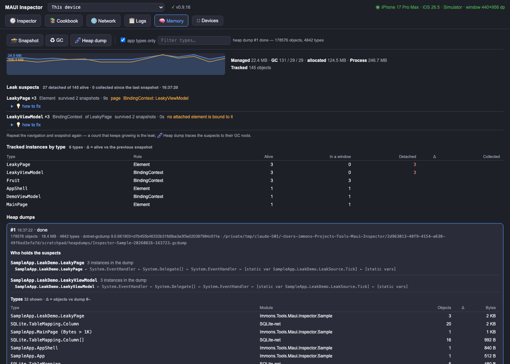

# Memory & leaks

The **🧠 Memory** view answers "what is still in memory, and why" for the app the panel is connected to.



- **Which process** — the app's name and pid sit above the readings: two apps on one simulator take neighbouring panel ports, and measuring the wrong one looks exactly like a fixed leak.
- **Live readings** — managed heap, GC counts (gen 0 / 1 / 2), bytes allocated so far; on Android also the Java heap, the native heap and the JNI global-reference count (the classic leak signal there); on iOS the physical footprint Xcode's gauge shows; on Windows the working set. A sparkline of the last minutes and a **♻︎ GC** button.
- **📌 Baseline → run → snapshot** — the measurement that settles it. Mark the baseline, walk your flow (push a page, go back, repeat), snapshot: every type shows what it **grew by since the baseline** and **per repetition**. "+9 objects per navigation, exactly linear" is a leak; "394 detached" alone is not a diagnosis.
- **⏻ Tracking** — the whole memory layer's on/off switch, at runtime, from the panel. Off means the inspector records nothing, empties its registry (so it holds no reference to any of the app's objects) and turns watch mode off with it; the per-element hooks return immediately, so the app carries no inspector memory work at all. The live readings — managed heap, process memory, the sparkline, the platform peers — keep working, because they cost one reading per second and nothing per element. Turning it back on re-reads the visual trees, so the tracked table fills up again from what is on screen. `options.Memory.TrackInstances` is the same switch at startup. The readings keep updating with it off, and that is not leftover work: nothing samples inside the app between polls — the panel asks, the app reads the counters on the HTTP thread and answers (~5 ms per call on an Android emulator, against ~13 ms of bare request overhead), never on the UI thread. With tracking off the panel drops to one poll every 5 s, and it stops polling entirely when you leave the Memory tab or put the browser tab in the background.
- **📸 Snapshot** — the leak detector. The inspector keeps a *weak* reference to every element that enters a window, plus its view model (`BindingContext`), handler and platform view — one weak reference per object, nothing else. A snapshot runs several full collections (`options.Memory.CollectionsPerSnapshot`, default 5: MAUI releases handlers and platform peers a round late), then sorts the survivors into **in a window** (fine), **detached** (alive although no window uses it — the suspects) and **collected**. A view model that no element is bound to is not automatically a suspect: if a live screen still reaches it — the filter built on one page and read by the popup that opens next — it counts as in use. Something that came loose seconds ago is listed with a *just detached* marker and sorted below the rest — often it is state between screens — but it is always listed: a leak is fresh the first time you see it too. Collected counts what died since the previous snapshot, so two snapshots in a row show zero — the running total since the baseline is shown next to it, and that is the number to read. With a heap dump at hand, each group also carries **what it costs** — the retained size of those instances, i.e. the bytes that would go away with them — and the header sums it: *"442 detached of 972 alive · holds 8.0 MB"*. Suspects come grouped by type with the MAUI-specific evidence: *page*, *handler still connected* (`DisconnectHandler` never ran), *inside DetailsPage* (a child along for the ride), the view model type, and how many snapshots they have survived — and each group carries a **💡 how to fix** note matched to that evidence (static events and messengers for pages, DI lifetimes for view models, `DisconnectHandlers()` for handlers, the iOS retain cycle for platform views). Click a group for its **parent chain** — the tree the object still sits in, up to the oldest ancestor, which is what the heap dump then has to explain. The table lists every tracked type with live / in-a-window / detached counts and **Δ** against the previous snapshot — push a page, go back, repeat, snapshot: `DetailsPage ×5, detached` is the leak, `+5` after the next round confirms it.
- **👁 Watch mode** — off by default (each snapshot is a few full collections): once on, a snapshot follows navigation in both directions — a page arriving matters as much as one leaving, because state the app parks between screens is in use again the moment the next screen binds it — debounced by `options.Memory.WatchDelay` so a burst of navigation costs one snapshot. The panel picks it up on its own; the suspects refresh without touching 📸 Snapshot. The **navigation ledger** records each page's push, pop, the memory it cost and the verdict — *collected* or *still alive* with the count of snapshots survived. A badge on the Memory tab counts the pages still alive. Toggle from the panel or `options.Memory.WatchNavigation`.
- **Your code vs its packages** — everything the Memory view calls an *app type* comes from your own assemblies: the one your `App` class lives in and its siblings under the same root name (`Contoso.Shop.Mobile` also owns `Contoso.Shop.Model`). Third-party packages — CommunityToolkit, SQLite-net, Mapster — are neither framework nor yours: they get their own colour and are never announced as "the place to look". `options.Memory.AppAssemblyPrefixes` overrides the rule.
- **Screens the inspector cannot see** — the ledger notices every `Page` that enters a window, which is most apps but not all: an overlay host that adds a layer to the current page, a custom modal, a tab shell of your own never pushes a `Page`, so for the ledger nothing happened. Report those and they behave like any pushed page:

  ```csharp
  using Inspector = Immons.Tools.Maui.Inspector;   // MAUI already has a Navigation in every page
  …
  Inspector.Navigation.ReportPushed(layer, "CheckoutOverlay");   // or the layer's view model
  …
  Inspector.Navigation.ReportPopped(layer);
  ```

  Only a weak reference is kept, the entry is marked *reported* in the ledger, and it counts towards the per-repetition growth like everything else.
- **Who holds it, in-process** — every snapshot also scans the static fields of the app's own types and the events and fields of the long-lived objects (`Application`, its windows, the `Shell`, the page containers): a static event with a handler on a popped page, a static list a view model sits in, a `Window` event a page subscribed to — reported on the suspect as *held by static event LeakSource.Tick → OnTick*, with the remedy. Most MAUI leaks end here, without a dump.
- **Parents chain & history** — click a suspect group for the tree it still sits in, up to the oldest ancestor; the **snapshot history** chart plots the detached count per app type across snapshots — the line that keeps climbing is the leak.
- **Bisection aids** — `🧪 disconnect handlers on pop` and `🧪 clear BindingContext on pop`: repeat the flow with one of them on; if the suspects vanish, you know whether the handlers or the view model held the page. Diagnosis only, never a fix.
- **Images** — the decoded bitmaps of the tracked `Image` / `ImageButton` elements with their size and bytes (Android adds every `Bitmap` the runtime still wraps, shown or not) — the usual native-memory hog on phones.
- **OS signals** — iOS memory warnings and Android `onTrimMemory` / `onLowMemory` land as red markers on the sparkline (gen-2 collections as thin ones); iOS shows the **headroom** before jetsam, Android the PSS and graphics memory.
- **Java peers** (Android) — Java.Interop's own list of every surfaced peer grouped by managed type, tracker or not, with GREF counts: the view that catches leaked platform views.
- **🧬 Heap dump** — the whole managed heap. The panel orders it, `maui-inspector-sync` on the desktop carries it out with `dotnet-gcdump` (through `dotnet-dsrouter` for Android and iOS, by PID on Windows), reads the `.gcdump` and posts a report back: every type with object counts and bytes, **Δ** against the previous dump, and — for the snapshot's suspects — the **shortest path to the GC root** (found by walking the reference graph backwards, so it is seven hops, not two hundred): `DetailsPage ← EventHandler ← Style ← ResourceDictionary ← [static vars]`. Click a path to see it as a stack, with the app types marked and each delegate hop explained as the event subscription it is. The types table sorts by any column (Objects, Δ, Bytes, Type, Module), filters by module, and can show only the types whose count changed since the previous dump. A dump takes as long as the heap is big — collecting streams every object out of the app as events, roughly **a minute per million objects** (measured: 358 k objects in seconds, 1.1 M in about two minutes), while reading the file back and building the report takes well under a second. The job card ticks the elapsed time so a long collection does not look stuck. Reports fold: the newest is open, the older ones are one line each (click to unfold), and a new dump takes the spotlight. The inspector's own objects — its trackers, the reports it holds, the mirror's frame — are hidden from the tables, the largest objects and the chains unless you ask for them with `○ inspector's own`, which also says how much they weigh. The `.gcdump` stays on disk (`--dumps` folder, default `<temp>/maui-inspector/heapdumps`) for Visual Studio or PerfView. Click a path to see it as a stack, with the app types marked, each delegate hop explained as the event subscription it is, and DI singletons named. Every chain is tagged by **what kind of root holds it** — `static` (your own static field), `interop` (a strong `GCHandle`: an ObjC or Java peer, which managed code cannot release — the native object has to go away), `handle`, `root` — which is the difference between "unsubscribe this event" and "the UIViewController was never dismissed". Every root entry carries its **retained size** (what would go away with those instances), the report lists the **largest objects** with their chains, and the types table sorts by any column (Objects, Δ, Bytes, Δ bytes, Type, Module), filters by module, marks types **new** since the previous dump, and traces any type to its roots with the 🧬 button on its row — read from the dump already on the desktop, no new collection.
- **⏺ Allocations** — the same hand-off with `dotnet-trace` for ten seconds: which types allocate how much while you scroll — GC pressure by type, per second, with an **app types only** switch and, when a heap dump is at hand, a **Live** column saying how many of that type are alive right now (plus 🧬 to trace them to their roots). *"`Outlet` allocated 14 MB in 10 s and 11 325 of them are alive"* is a complete sentence. On Android and iOS it is Mono's profiler provider reporting every allocation (a heap dump at the start names the types, so the first second is heavier). Mono only does that when the app was **started** with the allocation profiler, so the Diagnostics package switches it on for Debug builds by itself — nothing to configure; it costs the inlined allocation fast path, which a Debug build barely notices next to the interpreter, and Release never gets it. `<MauiInspectorAllocationTracking>false</MauiInspectorAllocationTracking>` turns it off. On Windows it is the sampled `gc-verbose` profile, no setup. (Mono names a type only while dumping the heap, so the tool asks the app to collect near the end of the recording — what stays unnamed is what never lived through a collection.) `dotnet-trace` is installed the same way as `dotnet-gcdump`.

Heap dumps need two things:

1. On the desktop: `maui-inspector-sync` running against the app. It brings `dotnet-gcdump` and `dotnet-dsrouter` along by itself — on the first dump it installs them (or a current enough copy: `--dsrouter` needs gcdump ≥ 9.0.652701) into `~/.maui-inspector/tools`, leaving your global tools untouched; `maui-inspector-sync tools` does that ahead of time, `--no-tool-install` turns it off.
2. On Android and iOS: a diagnostic port in the app — add the **`Immons.Tools.Maui.Inspector.Diagnostics`** package. It is build-only: its targets switch on the runtime's diagnostics component and a diagnostic port for **Debug** builds, and only there; in Release the package warns instead. `<MauiInspectorDiagnostics>false</MauiInspectorDiagnostics>` switches it off. Windows (CoreCLR) needs nothing.

Each app gets **its own port**, derived from its identity (the even numbers 9010–9088 — the Android router takes the one above it), and the sync tool starts one `dotnet-dsrouter` per app on its own socket — so two apps can be dumped at the same time on one machine, and neither blocks the other. `<MauiInspectorDiagnosticPort>9005</MauiInspectorDiagnosticPort>` pins a port of your own. (The tools' own `--dsrouter` shorthand hardcodes 9000, which is why the updater drives the router itself; a stale `maui-inspector-sync` from before this change cannot reach the new ports — restart it after updating.)

```xml
<PackageReference Include="Immons.Tools.Maui.Inspector.Diagnostics" Version="0.9.18" Condition="'$(Configuration)' == 'Debug'" />
```

The on-device panel's `⋯` row has **🧠 Mem** — a Memory pane with a snapshot button, watch mode, the suspects and the ledger, for the phone-in-hand case. Tracking is on by default; **⏻ Tracking** in the web panel turns it off at runtime, `options.Memory.TrackInstances = false` at startup.

**What the inspector itself costs** — it is a memory tool, so: the tracker keeps one weak reference per element, view model, handler and platform view (a few kilobytes for a real app); the mirror's fallback frame is dropped ten seconds after the last one is served; heap-dump reports are held gzipped and each job's card says how much (`holding 9 KB`); the network log, the ILogger sink and the memory timeline are fixed-size ring buffers. A dump of the sample with everything exercised attributes ~10 KB to inspector types.

**Diagnosing without the panel** — `POST /api/memory/snapshot` already returns the suspects with `hints`, `parents`, `owner` and `holders` (what the in-process scan found). Once a heap dump exists, every suspect also carries what only a dump can say: `chains` (the shortest paths to a GC root, as type names), `rootKind` (`static`, `interop`, `handle`, …), `retained` and the `dumpJob` it came from. So a script is two calls:

```bash
curl -s -X POST localhost:9295/api/memory/heapdump -d '{}' > /dev/null      # dumps and waits
curl -s -X POST localhost:9295/api/memory/snapshot | jq '.snapshot.suspects[] | select(.app)
   | {type, survived, rootKind, retained, holders, chain: .chains[0]}'
```

An empty `holders` with `rootKind: "interop"` is an answer, not a gap: the object is held by a native peer (an `NSNotificationCenter` observer, a `UIViewController` that was never dismissed, an Android listener), which no managed scan can see and no managed change can release.

## The leak-hunting skill (Claude Code)

The method this view is built around — measure twice N cycles apart, read the hints before
dumping, fix the first app-owned type in the chain — is packaged as a Claude Code skill in this
repository, together with the recurring MAUI causes and the API calls to drive the panel from a
script:

```
/plugin marketplace add Immons/Tools.Maui.Inspector
/plugin install maui-inspector@immons-maui-inspector
```

It loads itself when a conversation turns to leaks, detached-but-alive objects or memory growing
across navigation. The source is [`.claude/skills/memory-leak-hunting/SKILL.md`](https://github.com/Immons/Tools.Maui.Inspector/blob/main/.claude/skills/memory-leak-hunting/SKILL.md);
anyone working inside a clone of this repo gets it with no install at all.

**Leak gate for UI tests** — `MauiInspector.TakeMemorySnapshotAsync()` returns a `MemoryReport` whose `Leaks` lists the app's own types still alive without a window (with what holds them); `options.Memory.OnLeak` fires with the same list after any snapshot that finds new ones. Over HTTP, a Maestro or Appium run does the same with `POST /api/memory/snapshot` and asserts `totals.detached == 0` — or, with watch mode on, `GET /api/memory/ledger` and asserts no entry is `alive`. Exports: **⤓ md** (snapshot, ledger, latest dump as Markdown for a ticket) and **⤓ csv** (the types table).
